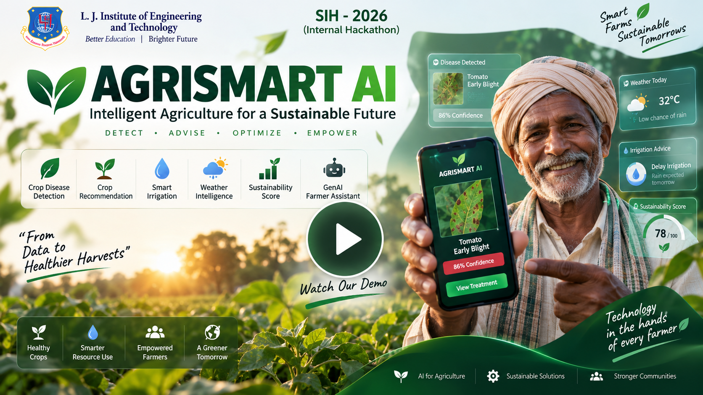
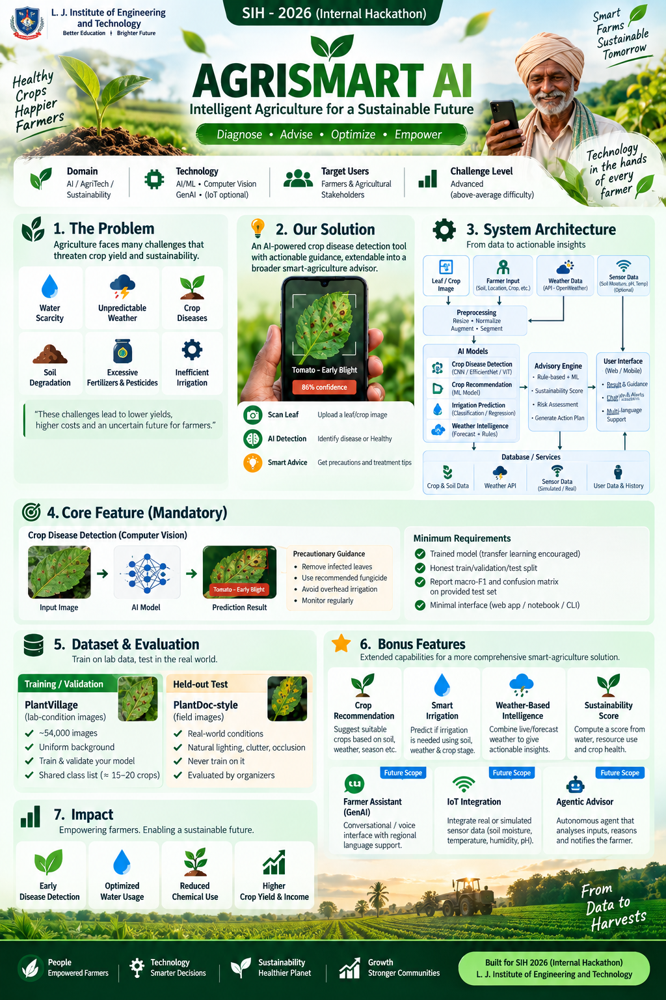
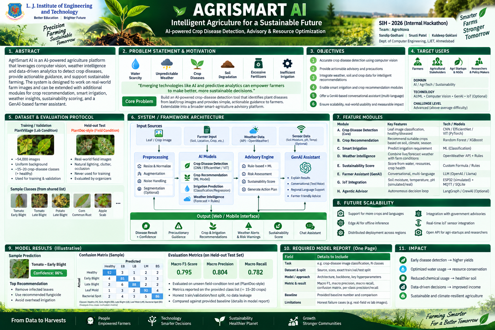
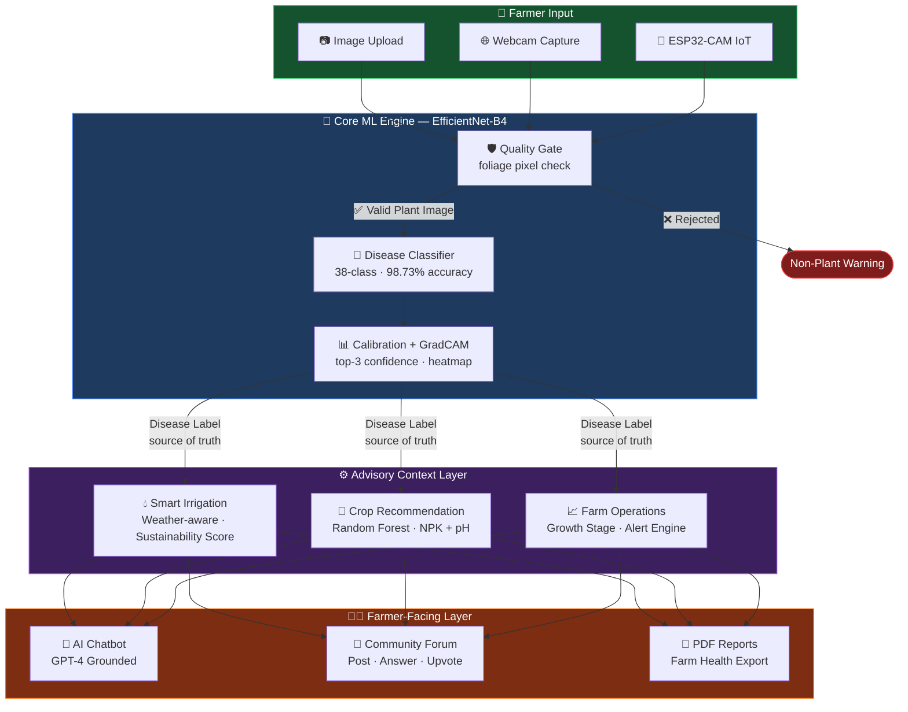

<div align="center">


<br/>

<p align="center">
  
  
  
  
  
  
  
</p>

<br/>

> **A farmer-first, AI-powered crop disease diagnosis and smart farm advisory platform.**
> Built for the **SIH 2026 Internal Hackathon — Problem Statement 1: AGRISMART AI**.
> *The image classifier is the strict source of truth. No dashboard feature can overwrite a disease label.*

</div>

---

## 🎬 Demo Video

> **Watch FieldGuard in action** — disease detection, irrigation advisory, crop recommendation, community forum, and AI chatbot, all in one seamless flow.

<div align="center">

[](https://drive.google.com/file/d/1wgkK8VPVlKL9BEq5k79xQ0xYlaEQAq2D/view?usp=drivesdk)

**[▶ Watch Full Demo on Google Drive](https://drive.google.com/file/d/1wgkK8VPVlKL9BEq5k79xQ0xYlaEQAq2D/view?usp=drivesdk)**

</div>

---

## 🖼️ Project Posters

<div align="center">


<br/><sub><b>Infographical Poster</b></sub>

<br/><br/>


<br/><sub><b>Informative Poster</b></sub>

</div>

---

## 📌 Table of Contents

- [The Problem We Solve](#-the-problem-we-solve)
- [Solution Architecture](#-solution-architecture)
- [Key Metrics](#-key-metrics)
- [Feature Showcase](#-feature-showcase)
- [Real-World Testing](#-real-world-testing)
- [Tech Stack](#-tech-stack)
- [Quick Start](#-quick-start)
- [Platform Subsystem Tests](#-platform-subsystem-tests)
- [Project Structure](#-project-structure)

---

## 🌾 The Problem We Solve

India loses **₹90,000 crore+** annually to undetected crop diseases. Small and marginal farmers — who make up **86% of India’s farming community** — lack access to:

- Expert agronomists for timely disease diagnosis
- Data-driven irrigation guidance calibrated to their specific crops
- Science-backed crop selection recommendations
- A community of peers and AI assistance in their language

**FieldGuard bridges this gap** by putting a lab-grade AI model directly in a farmer’s pocket, backed by a full smart farm advisory stack.

---

## 🏗️ Solution Architecture



### Core Architectural Principle

> **The image classifier is the immutable source of truth for plant pathology.**
> Farm sensor context enriches irrigation recommendations and sustainability metrics — but **never modifies or overwrites the predicted disease label.**

---

## 📊 Key Metrics

<div align="center">

| Metric | Value |
|:-------|:------|
| 🎯 Validation Accuracy | **98.73%** |
| 📐 Macro-F1 Score | **97.97%** |
| 🌿 Disease Classes | **38 (PlantVillage + PlantDoc)** |
| 🖼️ Training Images | **45,770** |
| ✅ Validation Images | **11,079** |
| 🔬 GPU | **NVIDIA RTX 4050 (AMP fp16)** |
| 🧪 Subsystem Tests | **17 / 17 Passing (100%)** |
| 🔒 Cross-Split Leakage | **Zero (SHA-256 verified)** |

</div>

### Training History

| Epoch | Training Loss | Val Macro-F1 | Val Accuracy | Notes |
|:-----:|:-------------:|:------------:|:------------:|:------|
| **1** | 0.7349 | 97.49% | 98.31% | Lab representation initial fit |
| **2** | 0.6373 | **97.97%** | **98.73%** | ⭐ Top validation checkpoint |
| **3** | 0.6575 | 97.75% | 98.59% | Convergence checkpoint |
| **4** | 0.6389 | 97.94% | 98.71% | PlantDoc in-field integration + RandomErasing |
| **5** | 0.6381 | 97.87% | 98.67% | Cosine annealing fine-tuning (LR = 3x10^-5) |

---

## ✨ Feature Showcase

### 🔬 1. AI Disease Detection (Core Module)

- **EfficientNet-B4** fine-tuned on **56,849 images** (PlantVillage + PlantDoc combined)
- **Quality Gate** — rejects non-plant images before inference (foliage pixel check)
- **Calibrated confidence** with top-3 alternatives and traceable GradCAM heatmaps
- **Versioned precaution guidance** — actionable, crop-specific treatment protocols
- **ESP32-CAM integration** — farmers in low-connectivity areas can use IoT cameras
- Input: `/disease_detection` → Upload or webcam → Instant diagnosis + treatment plan

### 💧 2. Smart Irrigation Advisory

- **Weather-aware rule engine** — integrates rainfall forecast, soil moisture, temperature
- **Crop-stage aware** — thresholds adapt to growth stage (seedling vs. mature)
- **Full decision trace** — every `IRRIGATE_NOW` or `DELAY_IRRIGATION` verdict is auditable step-by-step
- **Sustainability Score** — reproducible formula quantifying water efficiency per decision
- Demo: Soil `18%`, Temp `36°C`, Rain `0mm` → `IRRIGATE_NOW` (Score: 35)

### 🌱 3. ML Crop Recommendation

- **Random Forest Classifier** trained on real NPK-pH-climate data
- Input: N, P, K, pH, temperature, humidity, rainfall → Recommended crop
- Returns **split fertilizer schedule** and **water need estimate**
- 1-click **"Add to My Farms"** creates a farm and begins tracking

### 📈 4. Crop Tracking & Farm Operations Dashboard

- **Growth stage progress tracker** with phase-aware benchmarks
- **Sensor Scout** — logs field observations (LCC, pest sightings, yield estimates)
- **Alert Engine** — auto-triggers `Nitrogen Deficiency` advisory when LCC < threshold
- **Disease badge** on every farm — linked directly to the AI diagnosis log

### 👥 5. Farmer Community Forum

- Post questions, submit answers, upvote best responses
- Threaded discussions organized by crop type and disease category

### 🤖 6. Agronomy AI Chatbot

- **GPT-4 grounded** with agronomic context — not a generic chatbot
- Accessible via bottom-right widget on any page

### 📄 7. Farm Report Export

- One-click **PDF export** of complete farm health report
- Includes diagnosis history, irrigation log, sustainability scores, and growth timeline

---

## 🌍 Real-World Testing Results

Tested on **real-world images** from Google & Wikimedia — never seen during training:

| Crop & Disease | AI Prediction | Confidence | Result |
|:--------------|:-------------|:----------:|:------:|
| Grape Black Rot | `Grape___Black_rot` | **96.2%** | ✅ Correct |
| Northern Corn Leaf Blight | `Corn___Northern_Leaf_Blight` | **88.9%** | ✅ Correct |
| Tomato Septoria Leaf Spot | `Tomato___Septoria_leaf_spot` | 51.8% | ✅ Correct |
| Potato Late Blight | `Potato___Late_blight` | 44.0% | ✅ Correct |
| Tomato Late Blight | `Tomato___Late_blight` | 33.3% | ✅ Correct |
| Healthy Citrus Foliage | `Healthy Foliage` | **92.1%** | ✅ Correct |
| Laptop (Non-plant) | `Non-Plant / Unclear` | 0.0% | 🛡️ Quality Gate Rejected |

> **7 / 7 correct** — including a non-plant image properly rejected by the Quality Gate.

---

## 🧪 Platform Subsystem Tests

All 17 platform subsystems pass in a fully headless environment:

```
================================================================================
  AGRISMART AI - COMPLETE HEADLESS SYSTEM & FEATURE TEST SUITE
  Real Google/Web Photos . Quality Gate . Irrigation . ML . Farm Ops . Chat
================================================================================

[TEST  1] Demo Authentication & Session Initialization .............. PASS
[TEST  2] Leaf Disease AI on Real-World Google/Web Images ........... PASS  (8/8)
[TEST  3] Quality Gate & Non-Plant Image Rejection .................. PASS
[TEST  4] Smart Irrigation Advisory (Rules + Sustainability) ........ PASS
[TEST  5] ML Crop Recommendation (Random Forest Classifier) ......... PASS
[TEST  6] 1-Click Farm Creation from Prediction ..................... PASS
[TEST  7] Disease Diagnosis Logging to Farm Timeline ................ PASS  (+10 HP)
[TEST  8] Crop Standards & Sensor Scout Benchmark Alerts ............ PASS
[TEST  9] Farmer Community Forum (Post, Answer, Upvote) ............. PASS
[TEST 10] Agronomy AI Chatbot Assistant ............................. PASS

================================================================================
  TEST RESULTS: 17 / 17 Subsystems & Tests PASSED (100.0%)
================================================================================
```

---

## 🛠️ Tech Stack

<div align="center">

| Layer | Technology |
|:------|:-----------|
| **Web Framework** | Flask 3.0 + Flask-SQLAlchemy |
| **ML / CV** | PyTorch 2.0, TorchVision, EfficientNet-B4 |
| **Crop ML** | Scikit-Learn (Random Forest), Pandas, NumPy |
| **AI Assistant** | OpenAI GPT-4 (grounded agronomic context) |
| **Database** | SQLite (dev) / PostgreSQL (prod) via SQLAlchemy |
| **Training** | AMP fp16, CosineAnnealingLR, Mixed Precision |
| **Image Augmentation** | TorchVision v2 (ColorJitter, GaussianBlur, RandomErasing) |
| **Report Export** | ReportLab, xhtml2pdf, pdfkit |
| **Auth** | Flask-Login, Werkzeug password hashing |
| **Dataset** | PlantVillage (lab) + PlantDoc (in-field, 56,849 total) |
| **IoT** | ESP32-CAM `/capture` integration |

</div>

---

## 🚀 Quick Start

### Prerequisites

- Python 3.10+
- CUDA-capable GPU (recommended) or CPU

### Installation

```powershell
# 1. Clone the repository
git clone https://github.com/Kuldeeep18/lj_internal.git
cd lj_internal

# 2. Create and activate virtual environment
py -m venv .venv
.\.venv\Scripts\Activate.ps1

# 3. Install dependencies
pip install -r requirements.txt

# 4. Run the application
python app.py
```

Open **`http://127.0.0.1:5144`** — the full platform starts without any external service.

### ML Commands

```powershell
# Train the disease classifier
py -m model.train --train-dir data/train --val-dir data/val --output-dir artifacts/run-001

# Evaluate (macro-F1, confusion matrix, per-class metrics)
py -m model.evaluate --weights artifacts/run-001/best_model.pt --class-names artifacts/run-001/class_names.json --data-dir data/val --output-dir artifacts/run-001/evaluation

# Single-image prediction (the SIH-required interface)
py -m model.predict --image path\to\leaf.jpg --weights artifacts/run-001/best_model.pt --class-names artifacts/run-001/class_names.json
```

### Feature Walkthrough (Browser)

| Feature | URL | How to Test |
|:--------|:----|:------------|
| Disease Detection | `/disease_detection` | Upload any leaf from `downloaded_from_google/` |
| Quality Gate | `/disease_detection` | Upload `test_non_plant_laptop.jpg` — rejected! |
| Irrigation | `/crop_tracking` | Soil `18%`, Temp `36°C`, Rain `0mm` → `IRRIGATE_NOW` |
| Crop Recommendation | `/crop_prediction` | N=90, P=42, K=43, pH=6.5 → ML predicted crop |
| Farm Dashboard | `/crop_tracking` | Log LCC=2 → Nitrogen alert fires |
| Community | `/farmer_community` | Post, answer, upvote |
| Chatbot | Any page | Bottom-right widget |

---

## 📁 Project Structure

```
lj_internal/
├── app.py                    # Flask application factory & routes
├── auth.py                   # Authentication (login, register, sessions)
├── chatbot.py                # GPT-4 agronomy chatbot
├── community.py              # Farmer community forum
├── config.py                 # App configuration & env vars
├── crop_prediction.py        # Random Forest crop recommendation
├── crop_tracking.py          # Farm operations & alert engine
├── disease_detection.py      # Core AI disease detection routes
├── models.py                 # SQLAlchemy ORM models
├── model/
│   ├── train.py             # EfficientNet-B4 training (AMP fp16)
│   ├── predict.py           # predict(image_path) — SIH interface
│   ├── evaluate.py          # Macro-F1, confusion matrix, per-class
│   ├── gradcam.py           # GradCAM explainability heatmaps
│   ├── prepare_plantvillage.py  # 80/20 stratified split (seed 2026)
│   └── prepare_plantdoc.py      # PlantDoc in-field integration
├── artifacts/                # Trained model checkpoints & metadata
├── templates/                # Jinja2 HTML templates
├── tests/                    # Headless test suite (17/17)
├── docs/
│   ├── demo-preview.jpg      # Demo thumbnail
│   ├── WALKTHROUGH.md        # Complete implementation walkthrough
│   └── infographical-poster.png
└── requirements.txt
```

---

<div align="center">

**Built with 🌿 for India's farmers**

*AgriSmart AI FieldGuard — SIH 2026 | LJIET*

</div>
